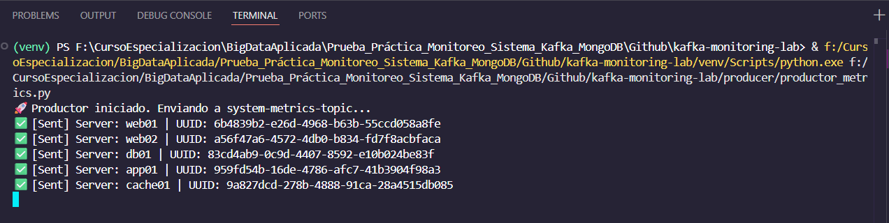
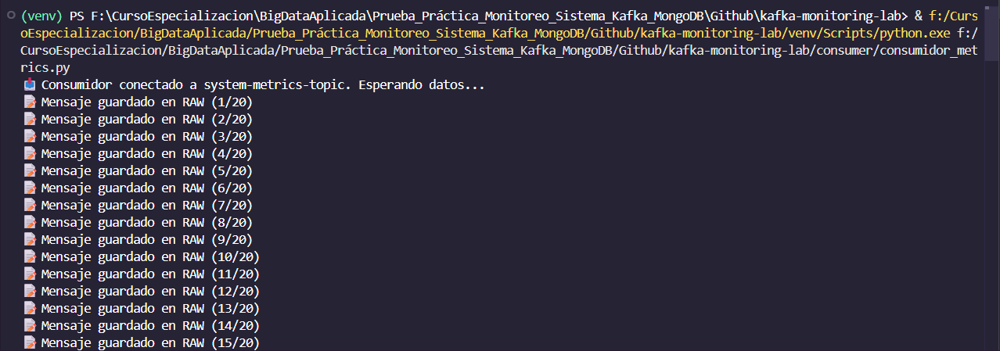
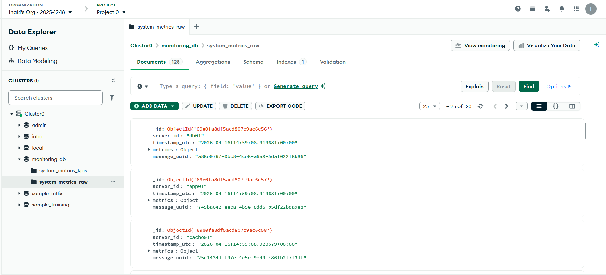
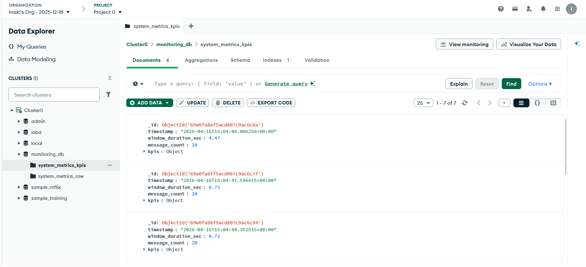
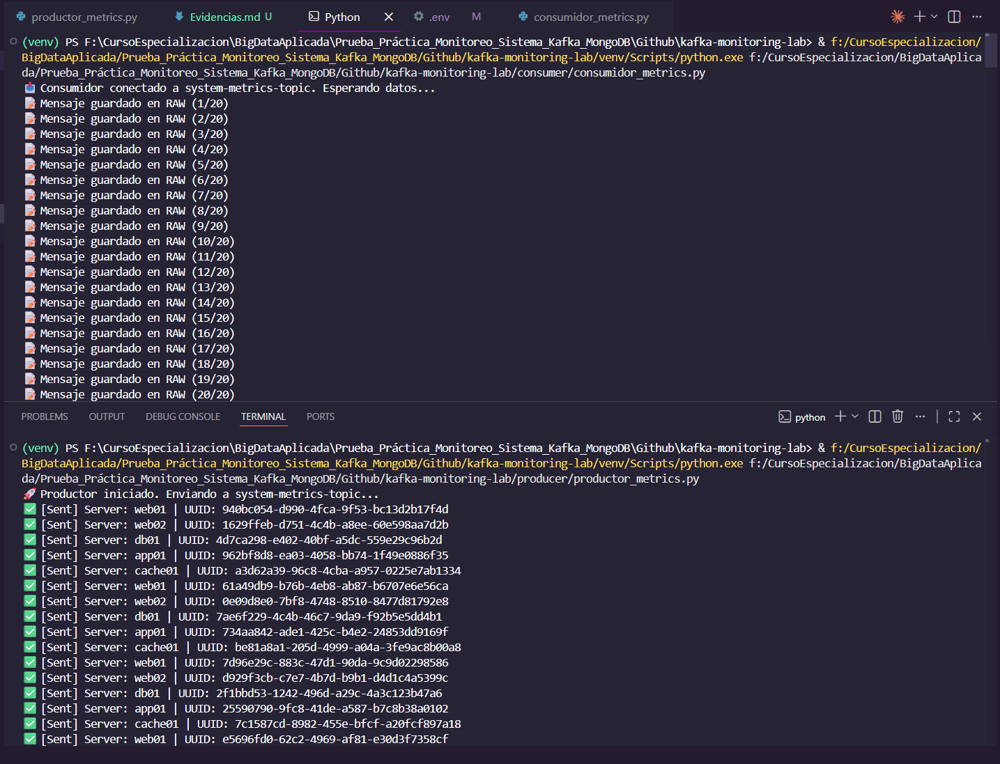

# Evidencias del Proyecto - Pipeline de Monitorización

Este documento contiene las capturas de pantalla que demuestran el correcto funcionamiento del sistema de monitorización basado en Kafka y MongoDB Atlas.

## 1. Productor enviando datos
El script `productor_metrics.py` genera métricas aleatorias para 5 servidores y las envía al tópico de Kafka cada 10 segundos.

## 2. Consumidor funcionando
El script `consumidor_metrics.py` recibe los mensajes de Kafka y procesa la ventana tumbling de 20 mensajes.

## 3. MongoDB Atlas - Colección RAW
Documentos almacenados en la colección `system_metrics_raw`, verificando que no hay pérdida de datos.

## 4. MongoDB Atlas - Colección KPIs
Documentos con los cálculos agregados (promedios de CPU, Memoria, etc.) almacenados en `system_metrics_kpis`.

## 5. Logs del sistema
Vista general de la ejecución simultánea y el flujo de información.

